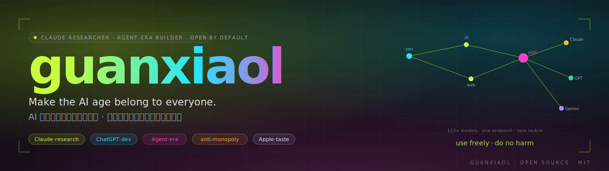

  
  
  
  

---

### 🧑‍💻 About me · 关于我

I build **AI infrastructure**, **LLM plumbing**, and **developer tooling** — the unglamorous layer that makes language models cheap, fast, and accessible. On the weekend I switch to riding bikes and turning Garmin data into posters that don't look like 2007 SaaS.

我做的事偏底层 —— **AI 基础设施**、**LLM 工具链**、给开发者用的代理 / 池化 / 自动化工具。周末上车骑行，把佳明导出的数据做成不那么 2007 风格的海报。

- 🔧 **[WindsurfPoolAPI](https://github.com/guanxiaol/WindsurfPoolAPI)** — Enterprise multi-account pool proxy serving **113+ AI models** (Claude · GPT · Gemini · Grok · DeepSeek · Kimi) through OpenAI & Anthropic-compatible APIs. **209+ ⭐**
- 🚴 **[GarminPoster](https://github.com/guanxiaol/garminposter)** — 100% client-side .fit/.tcx/.gpx → poster generator with Coggan-grade NP/IF/TSS/CP/VAM analytics · *demo*: <https://guanxiaol.github.io/garminposter/>
- 🧠 **[pomelo-context](https://github.com/guanxiaol/pomelo-context)** — Low-token protocol for agent-readable, human-readable artifacts
- 🤖 **[copilot-feedback-loop](https://github.com/guanxiaol/copilot-feedback-loop)** — VS Code extension putting humans back in the loop for Copilot Chat Agent
- 🛠 **[windsurf-private-dev](https://github.com/guanxiaol/windsurf-private-dev-archive-windsurfsign-0)** — Windsurf zero-cost batch registration, no email/domain needed
- 🧪 Interested in **HTTP/2 session pooling · gRPC · prompt-cache economics · Web ML · GIS for cyclists**
- 🌏 Based in China · code for the world · 简中 + English

---

### 🚀 Featured projects · 主推项目

<table>
  <tr>
    <td align="center" width="50%">
      
    </td>
    <td align="center" width="50%">
      
    </td>
  </tr>
  <tr>
    <td align="center" width="50%">
      
    </td>
    <td align="center" width="50%">
      
    </td>
  </tr>
</table>

> **WindsurfPoolAPI** highlight features: multi-platform binaries (macOS ARM/x64, Linux, Windows) · VS Code & Cursor extension · API-key auth + path-redaction sanitizer · HTTP/2 session pooling + conversation reuse + stall detection · CJK auto language steering · Docker one-command deploy.

---

### 📊 GitHub stats · 数据

<table>
  <tr>
    <td>
      
    </td>
    <td>
      
    </td>
  </tr>
  <tr>
    <td colspan="2" align="center">
      
    </td>
  </tr>
</table>

---

### 📈 Activity · 活动轨迹

<picture>
  <source media="(prefers-color-scheme: dark)" srcset="https://raw.githubusercontent.com/guanxiaol/guanxiaol/output/github-contribution-grid-snake-dark.svg" />
  <source media="(prefers-color-scheme: light)" srcset="https://raw.githubusercontent.com/guanxiaol/guanxiaol/output/github-contribution-grid-snake.svg" />
  
</picture>

---

### 🛠 Tech stack · 技术栈

**Languages**

**Frontend**

**Backend / Infra**

**AI / LLM**

**DevOps**

---

### 🌐 Connect · 联系

---

Built quietly. Shipped relentlessly. Star a repo if it helped — that's how I know.
 
悄悄做事，持续发布。觉得有用就给个 ⭐，那是我唯一的反馈渠道。

